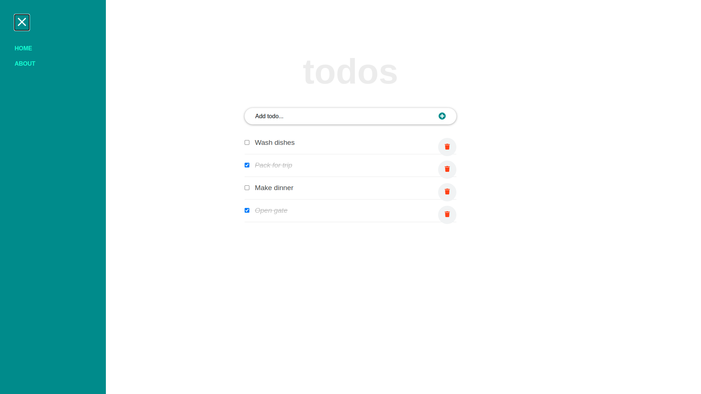

# My-portfolio

**To do app created following the [React Tutorial From Scratch: A Step-by-Step Guide](https://ibaslogic.com/react-tutorial-for-beginners/) (2021)**

## Built With

- ReactJS

## Live Demo

[Live Demo Link](https://yghoor.github.io/react-to-do-app/)

## Author

👤 **Yahya Ghoor**

- GitHub: [@yghoor](https://github.com/yghoor)

## Acknowledgments

- Icons from [React Icons](https://react-icons.github.io/react-icons/)

## 📝 License

This project is [MIT](./LICENSE) licensed.
